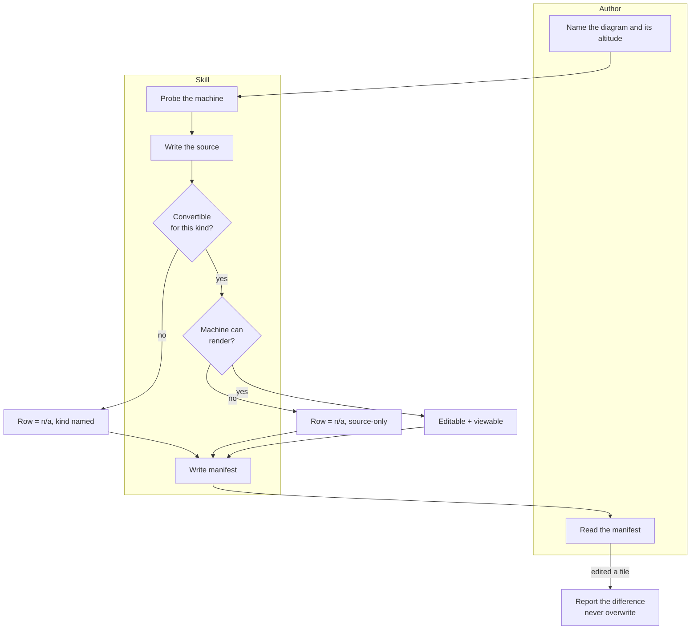

# Spec — a diagram that can leave the document, without leaving the source behind

Depth: FULL
Kind: FORWARD
Status: DRAFT
Implements: docs/discovery/2026-07-29-diagramming-architecture.md (status: DRAFT)
Date: 2026-07-29 · Author: agent
Agreed by — business owner: — · technical owner: —

> The discovery document is DRAFT. Its requirement IDs are not stable.

## 0. Gate table

| Stage | Gate | PASS / BLOCKED / n/a | Evidence | Escalated to |
|---|---|---|---|---|
| 1 | every touched subsystem cited, or "searched, found nothing" | **PASS** | §2 — 8 evidence rows, 2 not-found | — |
| 2 | every requirement and `C-n` claimed or out; non-NEW cites `E-n`; structural row exists | **PASS** | §3 — 5 components, 8 requirement rows, discovery emitted no `C-n` | — |
| 3 | grain, key + stability, owner, temporality, lifecycle with exits; transition per changed entity | **PASS** | §4 — 2 entities, both current-state, no changed entity | — |
| 4 | errors, authorisation, idempotency, consistency; events name consumers | **PASS** | §6 — 5 operations; no events (`n/a`) | — |
| 5 | every non-success terminal outcome has a handler; steps name their `OP-n` | **PASS** | §7 — 4 terminal outcomes | — |
| 6 | every FR and NFR has an AC; each observable with an assertion level | **PASS** | §8 — 10 criteria over 8 requirements | — |
| 7 | table complete; open decisions have owners; every decision has a reversibility | **PASS** | this table, §9 | — |

## 1. Summary

- **What we are building:** a step that takes the picture already written inside
  a design document and also saves it as a file other people can open and change.
- **The pieces it is made of:** instructions for the writer, a catalogue of which
  picture goes with which question and what each file format can carry, a form
  for the output, and a check of what this machine can actually produce.
- **What changes for the people who use it:** you can hand the picture to
  someone, they can move a box, and the written version stays the one that counts.
- **What we decided not to do:** install any drawing program, or reach the
  network. If the machine cannot draw, it says so and still gives you the source.
- **The decision still open that matters most:** whether an edited file coming
  back may ever overwrite the written source.
- Size: 5 components, 2 entities, 5 operations, 9 criteria.

## 2. Grounding — how it works today

A design document keeps its pictures as text inside the file. That is the right
choice for the document, and it is why the picture cannot be handed to anyone.

| # | What | Where | What it showed |
|---|---|---|---|
| E-1 | The inline rule | `skills/writing-specs/SKILL.md:230` | "Diagrams are **Mermaid, inline** — no external tool, no binary" |
| E-2 | The precedence rule | `skills/writing-specs/references/diagrams.md:113` | "The table is normative; the diagram is illustrative" |
| E-3 | The diagram catalogue that already exists | `skills/writing-specs/references/diagrams.md` | Which Mermaid type answers which question, with rules — this skill extends it rather than replacing it |
| E-4 | Renderer present locally | `drawio --version` → 31.0.2 | `-x` accepts **Mermaid input directly**; `-e` embeds the editable source; `--layout` offers elk/organic/tree |
| E-5 | Renderer absent on the deploy targets | `ssh djpl-dev-etl`, `ssh microvac-lab` | `drawio` not installed, `DISPLAY` empty on both |
| E-6 | Formats do not interoperate | `drawio -x -f svg t.excalidraw` → `Error: Export failed` | draw.io cannot read `.excalidraw`; two separate ecosystems |
| E-7 | Round-trip is real | `drawio -x -f xml -o back.xml t2.svg` | An embedded-source SVG converts back to XML |
| E-8 | The converter's ceiling | `gstack/diagram/SKILL.md`; `@excalidraw/mermaid-to-excalidraw` docs | Mermaid→Excalidraw supports **flowcharts only**, and the official converter is DOM-bound — this constrains *conversion*, not *generation* (E-12) |
| E-12 | Prior-art survey, 7 repos cloned and deleted 2026-07-29 | imported and exercised `nintynick/scripts/excalidraw.py` | **Generating `.excalidraw` is dependency-free**: 760 lines of pure stdlib exposing rectangle, ellipse, diamond, text, arrow, connect, image, `to_json`, `save`, `check_overlaps`. Open decision 2 is answerable on evidence |
| E-13 | Same survey | Excalidraw's own schema + reference implementation | `seed` and `versionNonce` are required and filled from `os.urandom(4)`. **Byte-identity is unachievable in both ecosystems**, not a draw.io quirk |
| E-14 | Same survey — `Sunwood-ai-labs/draw-io-skill` §6 | its lint script and thresholds | Rendered-SVG legibility linting is a required preflight there: 12 defect classes, `TEXT_OVERFLOW_TOLERANCE=4`, `BOX_BORDER_OVERLAP_THRESHOLD=10`, contrast by relative luminance. Nothing in this spec covered legibility before |
| E-9 | **Searched** `src/` for any diagram or render code | — | **Found nothing.** The renderer knows nothing about diagrams; this stays a skill |
| E-11 | **Day-zero test, 2026-07-29**: exported this spec's own container diagram (22 lines of Mermaid) → `.drawio.svg` | 294,172 bytes, editable source embedded, round-trip to XML confirmed. **Two runs are NOT byte-identical**: draw.io mints a random `diagram id` per run (`mSZ3H08…` vs `Ygj9EmD…`), same byte length | The export half of the thesis works on a real artifact; the byte-identity requirement as written is falsified |
| E-10 | **Searched** the repo for a bundled binary or vendored renderer | — | **Found nothing**, ADR-0017 is the rule that matters: the installer copies every file under `skills/<id>/` verbatim, so anything bundled reaches every target |

## 3. Shape — components and boundaries

Four written pieces plus one thing that already exists on some machines and not
others. One piece tells the writer how to proceed; two are opened only when
reached; one is the output. The drawing program is treated as a machine
capability to detect, never as something we ship.

| ID | Component | Level | Inside | Status | One responsibility | Owns | Depends on | If unavailable | Blocked by | Evidence | Serves |
|---|---|---|---|---|---|---|---|---|---|---|---|
| CMP-1 | Stage spine | component | the skill | NEW | Order the passes and refuse at each | gate verdicts | CMP-2, CMP-3, CMP-4 | reference absent → the stage cannot pass; gate says so | — | — | FR-1, FR-5, FR-6 |
| CMP-2 | Format and capability catalogue | component | the skill | NEW | Say what each format can carry and which conversions exist | the degradation matrix | — | n/a | — | E-6, E-8 | FR-5 |
| CMP-3 | Artifact-set form | component | the skill | NEW | Fix the file names, the manifest, and the ID scheme | `DG-n` and the provenance rule | — | n/a | — | — | FR-2, FR-3 |
| CMP-4 | Toolchain probe | component | the skill | NEW | Decide what this machine can produce, before producing anything | the capability verdict | CMP-5 | that is the point — absence is a normal verdict | — | E-5 | FR-3, FR-4 |
| CMP-5 | Local drawing program | container | the machine | **EXTERNAL** | Render and convert | nothing we control | — | source-only mode; `n/a` rows with a reason | — | E-4, E-5 | FR-4 |

First buildable slice: `CMP-2` and `CMP-3` are independent of everything and of
each other. `CMP-4` follows. `CMP-1` last.

**Requirement coverage**

| Requirement | What it says | Covered by | Or out because |
|---|---|---|---|
| FR-1 | text source → editable file | CMP-1, CMP-3 | |
| FR-2 | source normative; provenance; idempotent regeneration | CMP-3 | |
| FR-3 | detect toolchain; state produced-or-skipped per output | CMP-4, CMP-3 | |
| FR-4 | viewable form when possible | CMP-4, CMP-5 | |
| FR-5 | say which kinds convert; never imply false editability | CMP-2 | |
| FR-6 | name the altitude; refuse to mix two | CMP-1 | |
| FR-8 | legibility check on a produced viewable form | CMP-4 | |
| FR-7 | round-trip an edited artifact | — | **OUT-6** — cut from the first cut 2026-07-29 |
| NFR-1 | body under budget; catalogue loads on demand | CMP-2, CMP-3 | |

**Structural decision**

| Chosen | Alternative rejected | Boundary crossings | Why this one |
|---|---|---|---|
| Skill body + two on-demand references + an explicit capability probe; the drawing program stays EXTERNAL | Vendor a renderer, or drive a headless browser as `gstack/diagram` does | 2 (spine → each reference) + 1 (probe → the program) | ADR-0017 makes everything under `skills/<id>/` ship verbatim to every target; ADR-0005 forbids a bash orchestrator; `gstack`'s path needs a browse daemon and a prebuilt bundle that dstack has no way to ship. Treating the program as EXTERNAL is what makes the skill work unchanged on the two machines that lack it (E-5) |

## 4. Model — entities

Two things get tracked: the written picture and the files made from it.

| ID | Entity | Grain | Key | Stable across regeneration? | Owner | Temporality | Relationships | Serves |
|---|---|---|---|---|---|---|---|---|
| ENT-1 | Diagram source | one row = one diagram, at one altitude | `DG-n` + slug | yes — the ID never moves | CMP-3 | current-state only | 1 source produces 0..n artifacts | FR-1, FR-2 |
| ENT-2 | Rendered artifact | one row = one output file of one format | source key + format | regenerated, not versioned | CMP-4 | current-state only; superseded on regeneration | exactly 1 source per artifact | FR-3, FR-4 |

**Absence semantics.** An artifact row absent means *not produced*; a row present
with verdict `n/a` means *deliberately not produced, with a reason*. The two are
never merged — that distinction is the whole of `FR-3`.

**Output root.** Every artifact and the manifest are written to
`docs/design/YYYY-MM-DD-<slug>/` in the target system's repo — a user or repo
preference overrides it. This is a contract, not a convention: the discovery
document's metric counts files there.

**Schema — the artifact manifest**

| Field | Type | Absence | Constraint | Why |
|---|---|---|---|---|
| id | `DG-n` | not-null | unique per set | downstream citation |
| source file | path | not-null | relative to the set | provenance |
| source hash | string | not-null | of the text source | makes idempotence checkable |
| altitude | enum | not-null | context / container / component / data / process | `FR-6` |
| format | enum | not-null | mmd / drawio / drawio.svg / png / excalidraw | — |
| verdict | enum | not-null | produced / `n/a` + reason | `FR-3` |

## 5. Transition

`None — greenfield.` No existing artifact, no existing data, no cutover. The
first run produces the first set.

## 6. Contracts

Each piece promises the next one something. The promise that matters most is
the probe's: it decides what may be claimed before anything is claimed.

| ID | Operation | Owner | Takes | Returns | Writes | Consistency | Errors | Idempotent | Authorised for |
|---|---|---|---|---|---|---|---|---|---|
| OP-1 | Probe the machine | CMP-4 | nothing | a capability verdict | — | atomic — one verdict per run | program absent → `source-only`; present but no display → `source-only`; probe itself fails → `source-only`, never assume yes | yes | anyone |
| OP-2 | Emit the text source | CMP-1 | a diagram intent + altitude | `.mmd` | ENT-1 | atomic | unparseable → fix and retry, never ship a broken source | yes | anyone |
| OP-3 | Emit the editable file | CMP-1 | `.mmd` | `.drawio` XML | ENT-2 | atomic | conversion unsupported for this diagram kind → `n/a` with the kind named | yes — **identical after normalising the per-run random fields** — draw.io's `diagram id` (E-11) and, on the Excalidraw path, `seed`/`versionNonce` which the format requires and the reference implementation fills from `os.urandom` (E-13). Byte-identity is unachievable in either ecosystem and was falsified before build | anyone |
| OP-4 | Render the viewable form | CMP-4 | `.drawio` | `.drawio.svg`, `.png` | ENT-2 | atomic per file | `source-only` verdict → `n/a` with the reason; render error → surface it, do not retry silently | yes | anyone |
| OP-6 | **Commit the manifest** | CMP-3 | the observed result of every OP-2..OP-4 call | the manifest file | ENT-1, ENT-2 | atomic **per set** — written once, after the last artifact operation returns | a row is written from an **observed** result, never an intended one; if an artifact operation errored, its row reads failed, not produced; if the manifest write itself fails, nothing else is claimed | yes | anyone |

**Events.** `None — no message passing; every hand-off is a file on disk.`

**Error shape**, used by all five: `verdict` · `what was attempted` ·
`why it stopped` · `what the user still has`.

## 7. Process and interface

Someone has a design document with a picture in it. The step writes the picture's
source next to the document, turns it into a file that opens in a drawing tool,
and — if this machine can — renders something viewable. Whatever it could not do
is written down rather than left out.

**Terminal outcomes**

| Outcome | Reached when | Who handles it | How to get back in |
|---|---|---|---|
| Source only | the machine cannot render | the author, on a machine that can | re-run there; the source is unchanged |
| Not convertible | the kind has no editable conversion | the author | keep the viewable form, or pick a kind that converts |
| Render failed | the program errored | the author | the error is surfaced verbatim; fix the source and re-run |
| Diverged | an edited artifact no longer matches the source | the author | apply the change to the source and regenerate |

**Interface** — this is a file-producing step, so the "screen" is the manifest.

| Step | Via | Fields and validation | Empty | Loading | Partial | Denied | Failed |
|---|---|---|---|---|---|---|---|
| Probe | OP-1 | `n/a — no fields; not interactive` | `n/a — one shot` | `n/a — no async step` | `n/a` | `n/a` | verdict = `no-render`, never an exception |
| Request a diagram | OP-2 | question (required, one sentence) · altitude (required, one of five) · output root (optional, defaults) | no diagram named → refuse | `n/a` | `n/a` | `n/a` | unparseable source → error named, nothing written |
| Read the manifest | OP-6 | none — read-only surface | say plainly that nothing was produced and why | `n/a` | produced and skipped side by side — the normal case | `n/a` | never claim a format that is absent |

## 8. Acceptance criteria

| ID | Proves | Given | When | Then (observable) | Checked at |
|---|---|---|---|---|---|
| AC-1 | FR-1 | a diagram source | the skill runs on a machine with the program | a `.drawio` file exists that opens in the drawing tool | human |
| AC-2 | FR-2 | a produced set | the manifest is read | every artifact row names its source file and the source's hash | human |
| AC-3 | FR-2 | an unchanged source | the skill runs a second time | the produced files are identical **after normalising the generated `diagram id`** (E-11); the manifest's source hash is unchanged | e2e |
| AC-4 | FR-3 | a machine without the program | the skill runs | every render row reads `n/a` with a reason, the text source is still produced, and nothing claims a file that does not exist | e2e |
| AC-5 | FR-3 | any run | the report is read | produced and skipped outputs appear side by side, never only the produced ones | human |
| AC-6 | FR-4 | a machine with the program | the skill runs | a viewable file exists and its embedded source round-trips back to XML | e2e |
| AC-7 | FR-5 | a sequence or state diagram | the skill runs | the editable row reads `n/a` naming the kind, and the report does not describe the output as editable | human |
| AC-8 | FR-6 | a diagram request spanning two altitudes | the skill runs | it is split into one diagram per altitude, each labelled, or refused with the reason | human |
| AC-10 | NFR-1 | the skill source | `bun run validate` runs | 0 errors and no `token-near-budget` warning | e2e |
| AC-11 | FR-8 | a produced viewable form whose text overflows its box | the legibility check runs | the overflow is reported with the element named; the run does not present the diagram as clean | e2e |
| AC-12 | FR-8 | a run that produced no viewable form | the report is read | it states the legibility check **did not run**, and does not imply the diagram is legible | human |

## 9. Decisions

We kept the drawing program outside the skill on purpose, and we kept the
written version in charge. Everything else follows from those two.

| ID | Decision | Serves | Alternative rejected | Why | Reversibility | Decided by | ADR? |
|---|---|---|---|---|---|---|---|
| D-1 | The text source is normative; artifacts are generated and disposable | FR-2 | let the drawing file become the source once edited | Two editable sources drift, and the one that drifts is the one nobody diffs. Cost: a reviewer's edit must be re-expressed in the source — `OP-5` reports, a human applies | costly | agent | no — 2 of 3 |
| D-2 | The drawing program is `EXTERNAL` and probed, never shipped | FR-3, NFR-1 | vendor a renderer, or drive a headless browser | ADR-0017: the installer copies the skill folder verbatim, so a vendored renderer lands on machines that cannot run it (E-5). ADR-0005 forbids a bash orchestrator. An earlier draft cited ADR-0028 as banning binaries — it says no such thing | reversible | agent | no |
| D-3 | Absence is a first-class verdict, not an error | FR-3 | fail the run when the machine cannot render | Failing makes the skill unusable exactly where it is deployed; a written `n/a` is more honest than a green run that produced nothing | reversible | agent | no |
| D-4 | Both ecosystems are supported, neither is required | FR-1, FR-5 | pick one | They are separate (E-6) and serve different moments — one converts deterministically, the other is where humans already sketch | reversible | agent | no |
| D-5 | A diagram kind with no editable conversion is reported as such, never dressed up | FR-5 | ship the viewable form and stay quiet | E-8: flowcharts only. Implying editability that does not exist is the failure this row prevents | reversible | agent | no |

**Non-functional consequences**

| NFR | Structural consequence |
|---|---|
| NFR-1 | Forced the two-reference split — the capability matrix and the form together exceed the body ceiling |

**Open decisions**

| # | Question | Options | Owner | Blocks | Needed by |
|---|---|---|---|---|---|
| 1 | May an edited artifact ever write back to the source? | (a) never, as `OP-5` specifies; (b) yes, behind an explicit flag | repo owner | `FR-7`'s final shape | before the first round-trip |
| 2 | ~~Does `.excalidraw` earn its keep?~~ **Closed 2026-07-29 on evidence (E-12): generation is dependency-free and only rendering needs a browser. Kept as the hand-off format.** | — | — | — | — |

## 10. Out of scope

We are not installing anything, not going online, and not moving the picture out
of the design document. Someone still opens the file by hand to edit it.

| ID | Item | Why out | Cheap or expensive later | Revisit when |
|---|---|---|---|---|
| SOUT-1 | Bundling or installing a renderer | ADR-0017 install semantics + E-5 | Cheap — the probe already isolates it | never |
| SOUT-2 | Network or hosted rendering | Offline is the contract | Cheap | never |
| SOUT-3 | Replacing the spec's inline Mermaid | E-1, E-2 are right | Cheap — additive | never |
| SOUT-4 | Visual design and colour systems | Different craft | Moderate | a brand system is adopted |
| SOUT-5 | UI screens | `wireframing-interfaces` owns them | Cheap | never |
| SOUT-6 | **Round-trip of a human-edited artifact** (was FR-7/OP-5/AC-9) | Release-two machinery: it cannot occur until a human has received and returned an artifact, which A-1 doubts. Cut 2026-07-29 after the product point of view priced it | Cheap — additive, and the manifest already carries the hash it would need | A-1 is settled |

## 11. Cost, verification, and review

| Build effort | Ongoing load | Cutover | Fallback |
|---|---|---|---|
| Under one day | None — documents only | None; nothing in flight | The spec's inline Mermaid, exactly as today |

**Verifying in isolation**

| Seam | Double | Seed | Environment | Flag |
|---|---|---|---|---|
| probe → program | force `source-only` by clearing `PATH` | one flowchart, one sequence diagram | with and without `DISPLAY` | — |

**Reviewer log**

| Date | Reviewer, role | Objection | Resolution | Status |
|---|---|---|---|---|

## 12. Change log

| Date | Change | Affected IDs | Reason | Approved by | Plan tasks invalidated |
|---|---|---|---|---|---|
| 2026-07-29 | Initial draft | all | — | — | — |
| 2026-07-29 | Day-zero export test run on this spec's own diagram. Export, embed and round-trip all confirmed; **byte-identity falsified** — OP-3 and AC-3 rescoped to identical-after-normalisation. FR-7 cut to SOUT-6. Manifest-commit operation OP-6 added — no operation wrote the manifest. Output root named. ADR-0028 replaced by ADR-0017 as the authority | E-11, OP-3, OP-6, AC-3, AC-9, FR-7, SOUT-1, SOUT-6 | Five-point-of-view review + an empirical test | — | Task 3 step 3, Task 5 |
