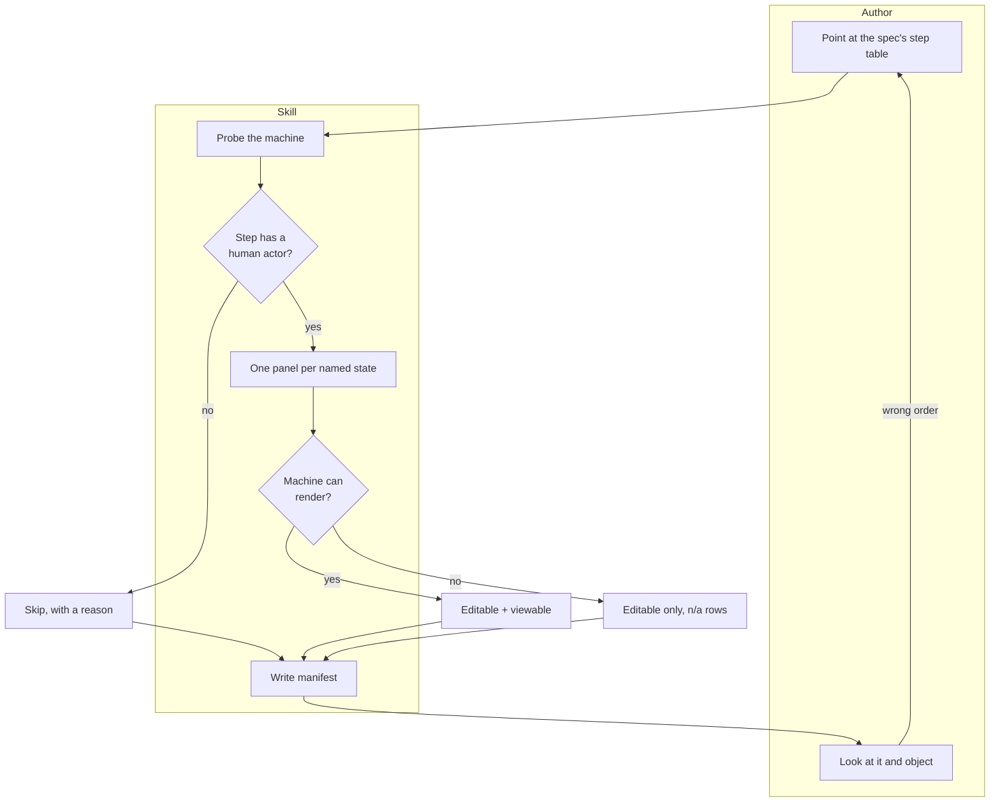

# Spec — a screen you can argue with before anyone builds it

Depth: FULL
Kind: FORWARD
Status: DRAFT
Implements: docs/discovery/2026-07-29-wireframing-interfaces.md (status: DRAFT)
Date: 2026-07-29 · Author: agent
Agreed by — business owner: — · technical owner: —

> The discovery document is DRAFT. Its requirement IDs are not stable.

## 0. Gate table

| Stage | Gate | PASS / BLOCKED / n/a | Evidence | Escalated to |
|---|---|---|---|---|
| 1 | every touched subsystem cited, or "searched, found nothing" | **PASS** | §2 — 7 evidence rows, 1 not-found | — |
| 2 | every requirement and `C-n` claimed or out; non-NEW cites `E-n`; structural row exists | **PASS** | §3 — 5 components, 8 requirement rows, discovery emitted no `C-n` | — |
| 3 | grain, key + stability, owner, temporality, lifecycle with exits; transition per changed entity | **PASS** | §4 — 2 entities, no changed entity | — |
| 4 | errors, authorisation, idempotency, consistency; events name consumers | **PASS** | §6 — 4 operations; no events (`n/a`) | — |
| 5 | every non-success terminal outcome has a handler; steps name their `OP-n` | **PASS** | §7 — 4 terminal outcomes | — |
| 6 | every FR and NFR has an AC; each observable with an assertion level | **PASS** | §8 — 10 criteria over 8 requirements | — |
| 7 | table complete; open decisions have owners; every decision has a reversibility | **PASS** | this table, §9 | — |

## 1. Summary

- **What we are building:** a rough picture of each screen, drawn from what the
  design document already says the screen must do.
- **The pieces it is made of:** instructions for the writer, a small set of plain
  shapes, a form for the output, and a check of what this machine can draw.
- **What changes for the people who use it:** you can look at the screen and say
  "that is not the order we do it in" while changing it still costs a redraw.
- **What we decided not to do:** decide how it looks. No colours, no fonts, no
  spacing — on purpose, so nobody mistakes it for finished.
- **The decision still open that matters most:** whether a screen with no human
  on it should be drawn at all.
- Size: 5 components, 2 entities, 4 operations, 10 criteria.

## 2. Grounding — how it works today

The design document already says what each screen must do and what it shows when
things go wrong. It says nothing about how any of it is arranged, and that
arrangement is currently made while the screen is being built.

| # | What | Where | What it showed |
|---|---|---|---|
| E-1 | The behaviour rule | `skills/writing-specs/SKILL.md:195` | "interface behaviour, which is **states and rules, not pixels**" |
| E-2 | The input this skill consumes | `skills/writing-specs/references/spec-doc.md:241` | The per-step table: boundary crossed, fields and validation, and Empty / Loading / Partial / Denied / Failed |
| E-3 | The exclusion, and its stale trigger | `docs/discovery/2026-07-28-writing-specs.md:89` | Mockups out of scope, revisit "when a Figma-driven workflow is actually adopted" — a condition that never fired; amended 2026-07-29 |
| E-4 | Neutral shapes render offline | rendered `mxgraph.mockup.containers.browserWindow`, `.forms.searchBox`, `.forms.button` | The mockup library works with no network, and the editable source survives in the SVG |
| E-5 | Renderer absent on the deploy targets | `ssh djpl-dev-etl`, `ssh microvac-lab` | Not installed, `DISPLAY` empty on both |
| E-6 | The actor classes a screen must serve | `writing-specs` review, UX researcher point of view | People without accounts and people acted upon are invisible to a roles table — and to any screen derived only from one |
| E-7 | **Searched** the repo for any existing wireframe, mockup, or screen artifact | — | **Found nothing.** Greenfield |
| E-8 | Prior-art survey, 7 public skill repos cloned and deleted 2026-07-29 | `Sunwood-ai-labs/draw-io-skill` §6 | Rendered-SVG legibility linting is a required preflight there — 12 defect classes including text overflow by width and height, contrast, and colliding labels. **"mockup" and "wireframe" appear zero times in it**: the wireframe case has no precedent in the survey either |

## 3. Shape — components and boundaries

Four written pieces plus the drawing program, which is treated exactly as its
sibling treats it: a machine capability to detect, never something we ship.

| ID | Component | Level | Inside | Status | One responsibility | Owns | Depends on | If unavailable | Blocked by | Evidence | Serves |
|---|---|---|---|---|---|---|---|---|---|---|---|
| CMP-1 | Stage spine | component | the skill | NEW | Order the passes and refuse at each | gate verdicts | CMP-2, CMP-3, CMP-4 | reference absent → stage cannot pass | — | — | FR-1, FR-2, FR-4, FR-6 |
| CMP-2 | Shape and fidelity catalogue | component | the skill | NEW | The permitted shapes, and the fidelity ceiling | the "not visual design" rule | — | fall back to plain rectangles | — | E-4 | FR-5 |
| CMP-3 | Screen-set form | component | the skill | NEW | Fix the per-screen columns, the state grid, and the ID scheme | `WF-n` and the trace rule | — | n/a | — | E-2 | FR-2, FR-4 |
| CMP-4 | Toolchain probe | component | the skill | NEW | Decide what this machine can produce | the capability verdict | CMP-5 | absence is a normal verdict | — | E-5 | FR-3, FR-7 |
| CMP-5 | Local drawing program | container | the machine | **EXTERNAL** | Render | nothing we control | — | source-only mode | — | E-4, E-5 | FR-3 |

First buildable slice: `CMP-2` and `CMP-3`, independent of everything.

**Requirement coverage**

| Requirement | What it says | Covered by | Or out because |
|---|---|---|---|
| FR-1 | step table → low-fidelity picture per screen | CMP-1, CMP-3 | |
| FR-2 | draw every state the spec names; missing state = gap row | CMP-1, CMP-3 | |
| FR-3 | editable file + viewable form when possible | CMP-4, CMP-5 | |
| FR-4 | cite step and requirement IDs per screen | CMP-3 | |
| FR-5 | cap fidelity; visible "not visual design" marker | CMP-2 | |
| FR-6 | show navigation between screens, including the rejection route | CMP-1 | |
| FR-7 | detect toolchain; state produced-or-skipped per output | CMP-4 | |
| FR-8 | legibility check on a produced viewable form | CMP-4 | |
| NFR-1 | body under budget; catalogue loads on demand | CMP-2, CMP-3 | |

**Structural decision**

| Chosen | Alternative rejected | Boundary crossings | Why this one |
|---|---|---|---|
| A separate skill sharing its sibling's probe *pattern* but not its code | Fold wireframes into `diagramming-architecture` as one more diagram kind | 2 (spine → each reference) + 1 (probe → program) | A screen is not an architecture view: different input (the step table, not a Mermaid intent), different reviewer, and a fidelity ceiling that would make no sense applied to a container diagram. Cost: the probe logic is described twice — accepted, because a shared component would couple two skills that must remain independently invocable |

## 4. Model — entities

| ID | Entity | Grain | Key | Stable? | Owner | Temporality | Relationships | Serves |
|---|---|---|---|---|---|---|---|---|
| ENT-1 | Screen | one row = one step a person interacts with, at one moment | `WF-n` + slug | yes — never renumbered | CMP-3 | current-state only | 1 screen realises 1..n spec steps; has 1..n state panels | FR-1, FR-4 |
| ENT-2 | State panel | one row = one screen in one named state | screen key + state | regenerated | CMP-3 | current-state; superseded on regeneration | exactly 1 screen per panel | FR-2 |

**Absence semantics.** A state with no panel means *not drawn*; a panel marked
`n/a` means *deliberately not drawn, with a reason* — a step with no loading
phase legitimately has no loading panel. Merging the two would hide `FR-2`.

**Output root.** Every artifact and the manifest are written to
`docs/design/YYYY-MM-DD-<slug>/` in the target system's repo — a user or repo
preference overrides it. This is a contract, not a convention: the discovery
document's metric counts files there.

**Schema — the screen manifest**

| Field | Type | Absence | Constraint | Why |
|---|---|---|---|---|
| id | `WF-n` | not-null | unique | citation |
| realises | step + requirement IDs | not-null | ≥1 each | `FR-4` |
| states drawn | list | not-null | subset of the spec's five | `FR-2` |
| states skipped | list of reason | not-null | complement of the above | `FR-2` |
| fidelity marker | boolean | not-null | must be true | `FR-5` |
| verdict per format | enum | not-null | produced / `n/a` + reason | `FR-7` |

## 5. Transition

`None — greenfield.` No screens exist; nothing to migrate.

## 6. Contracts

| ID | Operation | Owner | Takes | Returns | Writes | Consistency | Errors | Idempotent | Authorised for |
|---|---|---|---|---|---|---|---|---|---|
| OP-1 | Probe the machine | CMP-4 | nothing | capability verdict | — | atomic | any failure → `source-only`, never assume yes | yes | anyone |
| OP-2 | Derive the screen list | CMP-1 | the spec's step table | screens + states to draw | ENT-1 | atomic | no step table → refuse, route to `/writing-specs`; a step with no human actor → skipped with a reason, not drawn | yes | anyone |
| OP-3 | Emit the editable file | CMP-1 | screens + states | `.drawio` XML | ENT-2 | atomic | a shape unavailable → plain rectangle plus a note, never a silent substitution | yes — same input, same bytes | anyone |
| OP-5 | **Commit the manifest** | CMP-3 | the observed result of every OP-2..OP-4 call | the manifest file | ENT-1, ENT-2 | atomic **per set** — written once, after the last drawing operation returns | rows come from observed results only; a failed draw reads failed, never produced | yes | anyone |
| OP-4 | Render the viewable form | CMP-4 | `.drawio` | `.svg`, `.png` | ENT-2 | atomic per file | `source-only` → `n/a` with the reason | yes | anyone |

**Events.** `None — every hand-off is a file on disk.`

**Error shape:** `verdict` · `what was attempted` · `why it stopped` · `what you
still have`.

## 7. Process and interface

Someone has a design document whose step table lists what each screen must do.
The step turns each interactive step into a rough picture — one panel per state
the document names — and draws the routes between them, including the one where
the request is sent back.

**Terminal outcomes**

| Outcome | Reached when | Who handles it | How to get back in |
|---|---|---|---|
| No step table | the spec has none | the author | run `/writing-specs` first |
| Nothing to draw | no step has a human actor | the author | correct outcome; the manifest says so |
| Source only | the machine cannot render | the author | re-run where it can |
| Rejected by the reviewer | the flow is wrong | the author | fix the **spec**, then regenerate — never patch the picture alone |

**Interface** — the artifact a person actually reads is the screen set.

| Step | Via | Empty | Loading | Partial | Denied | Failed |
|---|---|---|---|---|---|---|
| Derive | OP-2 | no step table → refuse and route | `n/a — synchronous` | some steps skipped with reasons | `n/a` | malformed table → name the defect, do not guess |
| Draw | OP-3 | no screens → say so plainly | `n/a` | a shape missing → rectangle + note | `n/a` | error surfaced verbatim |
| Report | — | say nothing was produced and why | `n/a` | drawn and skipped side by side | `n/a` | never claim a panel that does not exist |

## 8. Acceptance criteria

| ID | Proves | Given | When | Then (observable) | Checked at |
|---|---|---|---|---|---|
| AC-1 | FR-1 | a spec step table with three interactive steps | the skill runs | three screens exist, each opening in the drawing tool | human |
| AC-2 | FR-2 | a step whose spec names Empty, Denied, and Failed | the skill runs | three panels exist for that screen, and any of the five states not drawn appears in the skipped list with a reason | human |
| AC-3 | FR-2 | a step whose spec names no Loading state | the skill runs | the loading panel is absent **and** listed as skipped — not silently missing | human |
| AC-4 | FR-3 | a machine without the program | the skill runs | the editable file still exists, render rows read `n/a` with a reason, and nothing claims a file that is absent | e2e |
| AC-5 | FR-4 | any produced screen | the manifest is read | it names ≥1 spec step and ≥1 requirement ID; a screen tracing nowhere does not exist | human |
| AC-6 | FR-5 | any produced artifact | it is inspected | no brand colour, no typeface choice, no spacing scale; every screen carries a visible "not visual design" marker | human |
| AC-7 | FR-6 | a flow with a rejection route | the skill runs | the navigation shows where a rejected request goes and how the person returns | human |
| AC-8 | FR-7 | any run | the report is read | drawn and skipped appear side by side | human |
| AC-9 | FR-1 | a step with no human actor — a nightly job | the skill runs | no screen is drawn for it, and the reason is recorded | human |
| AC-10 | NFR-1 | the skill source | `bun run validate` runs | 0 errors, no `token-near-budget` warning | e2e |
| AC-11 | FR-8 | a produced panel whose field label overflows its control | the legibility check runs | the overflow is reported naming the screen and the control; the panel is not presented as clean | e2e |

## 9. Decisions

We capped how good this is allowed to look, on purpose. Everything else follows.

| ID | Decision | Serves | Alternative rejected | Why | Reversibility | Decided by | ADR? |
|---|---|---|---|---|---|---|---|
| D-1 | Fidelity is capped, and the cap is visible on the artifact | FR-5 | let it look as good as the tool allows | A picture that reads as finished suppresses the objection it exists to invite — the reviewer starts discussing colour instead of order. Cost: it will look crude, and someone will ask why | costly | agent | no — 2 of 3 |
| D-2 | The spec's step table is the only input; no separate interview | FR-1 | elicit the screens directly | Two sources for one screen drift, and the spec already carries fields, validation, and states (E-2). Cost: a bad step table yields a bad screen — visibly, which is the point | reversible | agent | no |
| D-3 | Every state the spec names gets a panel; skipping is recorded | FR-2 | draw the populated state only | The populated state is the one everybody already imagines correctly; the empty and denied states are where screens are actually wrong | costly | agent | no |
| D-4 | A separate skill from `diagramming-architecture`, duplicating the probe *pattern* | — | one skill, two modes | Different input, different reviewer, different fidelity rule; coupling them would make each unusable alone. Cost: the probe is described twice | reversible | agent | no |
| D-5 | Rejection is fixed in the spec, never in the picture | FR-1, FR-6 | let the picture be edited directly | The picture is generated; an edit there is lost on the next run and invisible to everyone reading the spec | costly | agent | no |

**Non-functional consequences**

| NFR | Structural consequence |
|---|---|
| NFR-1 | Forced the two-reference split, as in both siblings |

**Open decisions**

| # | Question | Options | Owner | Blocks | Needed by |
|---|---|---|---|---|---|
| 1 | Should a step with no human actor ever get a picture? | (a) never, as `OP-2` specifies; (b) draw a data-flow panel instead | repo owner | `AC-9` | before build |
| 2 | Does the fidelity cap survive contact with a real stakeholder, or will it be read as "unfinished work"? | (a) keep the cap and explain it; (b) allow one polished variant per set | repo owner | `D-1` | first stakeholder review |

## 10. Out of scope

We are not deciding how it looks, not making it clickable, and not writing any
front-end. Someone still designs the real interface afterwards.

| ID | Item | Why out | Cheap or expensive later | Revisit when |
|---|---|---|---|---|
| SOUT-1 | Visual design: brand, colour, type, spacing | Different craft, different reviewer; the cap is the point | Cheap — additive | a design system is adopted |
| SOUT-2 | Clickable prototypes | Different tool, different feedback loop | Moderate | a usability practice exists |
| SOUT-3 | Front-end code or markup | `writing-plans` and implementation own it | Cheap | never |
| SOUT-4 | Accessibility conformance testing | `designing-test-cases` derives it, `running-uat` runs it — a picture cannot prove it, though it shows focus order and labels | Cheap | never |
| SOUT-5 | Architecture and process diagrams | `diagramming-architecture` owns them | Cheap | never |

## 11. Cost, verification, and review

| Build effort | Ongoing load | Cutover | Fallback |
|---|---|---|---|
| Under one day | None — documents only | None | The spec's step table, read as a table |

**Verifying in isolation**

| Seam | Double | Seed | Environment | Flag |
|---|---|---|---|---|
| probe → program | clear `PATH` to force `source-only` | one spec with 3 interactive steps + 1 nightly job | with and without `DISPLAY` | — |

**Reviewer log**

| Date | Reviewer, role | Objection | Resolution | Status |
|---|---|---|---|---|

## 12. Change log

| Date | Change | Affected IDs | Reason | Approved by | Plan tasks invalidated |
|---|---|---|---|---|---|
| 2026-07-29 | Initial draft | all | — | — | — |
| 2026-07-29 | Manifest-commit operation OP-5 added — no operation wrote the manifest. Output root named. The actor rule made syntactic: the step table has no actor column, so "has a human actor" was not derivable from the declared input | OP-5, A-4, OP-2 | Five-point-of-view review | — | Task 3 step 3 |
