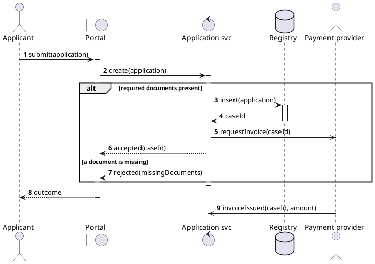

# Sequence diagrams — components, fragments, and what a render hides

## The components

| Component | PlantUML | Means |
|---|---|---|
| Actor lifeline | `actor "Applicant" as app` | a human or external system driving the interaction |
| Participant lifeline | `participant "Portal" as P` | a part of the system |
| Typed lifelines | `boundary`, `control`, `entity`, `database`, `queue`, `collections` | the same thing with a shape that says what kind of part it is |
| Synchronous message | `A -> B : submit(application)` | the caller waits |
| Asynchronous message | `A ->> B : publish(event)` | the caller does not wait |
| Return | `B --> A : caseId` | dashed. Only where the caller waited |
| Activation | `activate B` … `deactivate B` | B is doing work for this call |
| Creation / destruction | `create C`, `destroy C` | the lifeline begins or ends mid-diagram |
| Combined fragment | `alt` / `opt` / `loop` / `par` / `break` / `critical` … `end` | conditional or repeated behaviour |
| Reference | `ref over A, B : Settle payment` | another diagram covers this stretch |

Use the typed lifelines when the *kind* of part matters — `database` for a
store, `boundary` for the edge the actor touches. When it does not, plain
`participant` is less noise.

## The rules

1. **Declare every lifeline.** PlantUML invents one for any undeclared name, so
   a typo silently becomes a participant. `check_uml.py` reports these as
   `phantom` — treat one as a defect, never a shortcut.
2. **An actor starts the diagram.** A sequence beginning with an internal call
   is an architecture picture; `/diagramming-architecture` owns those.
3. **A return arrow is dashed and optional.** Draw it where the caller waits on
   a value that matters. Drawing every return doubles the arrows and halves the
   readability.
4. **`alt` means two or more branches; `opt` means one.** Readers rely on the
   distinction. `check_uml.py` reports an `alt` with no `else`.
5. **Draw one failure.** Timeout, rejection, refusal. A sequence with only the
   success path is where error handling goes unspecified.
6. **Activation bars must balance.** An `activate` with no `deactivate` renders,
   and misleads about who is still holding the call.
7. **Roughly a dozen messages.** Past that, extract a stretch behind
   `ref over` and give it its own diagram.
8. **`autonumber`** — turn it on. A numbered step is what a reviewer cites.

## One complete model

Read what this fixes that prose cannot: the applicant does **not** wait for the
payment provider, the rejection returns without touching the registry, and the
invoice arrives as a separate inbound message rather than a return value. Each
is a decision someone can now object to.

## Fragments, and when each is right

| Fragment | Use when | Trap |
|---|---|---|
| `alt` / `else` | two or more mutually exclusive paths | one branch means you wanted `opt` |
| `opt` | something that sometimes happens | nesting three `opt`s where a decision table belongs |
| `loop` | repetition | say the bound: `loop for each document`, not bare `loop` |
| `par` | genuinely concurrent | drawing `par` for things that merely *could* be concurrent overstates the design |
| `break` | the interaction ends here | often confused with `opt`; `break` abandons the rest |
| `critical` | must not be interleaved | rarely needed; say why in a note |
| `ref over` | another diagram covers this | the referenced diagram must exist |

Nest at most two deep. Three nested fragments is a decision table pretending to
be a picture — write the table and reference it.

## What a render will not tell you

PlantUML exits 0 on a syntax error, so none of these announce themselves:

| Error | How it shows up | How to catch it |
|---|---|---|
| A message with no target | the line is dropped, the rest renders | `check_uml.py` reports `dangling` |
| A misspelled lifeline | a new lifeline appears | `check_uml.py` reports `phantom` |
| A whole broken file | a tiny SVG with almost no text | the render round-trip in `check_uml.py` |
| An unclosed fragment | the diagram renders shorter | `check_uml.py` reports `unbalanced` |
| The order is wrong | it renders perfectly | read it aloud against the textual use case |

The last row has no mechanical check and never will. A sequence diagram is
*about* ordering, so the ordering is the one thing a tool cannot verify for you.
Read it against the use case's main flow, step by numbered step.
