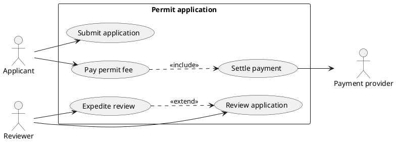

# Use case diagrams — components, rules, and the traps

## The components, and there are only five

| Component | PlantUML | Means |
|---|---|---|
| Actor | `actor "Applicant" as app` | someone or something **outside** the system that the system serves or depends on |
| Use case | `usecase "Submit application" as UC1` | a goal an actor reaches by using the system, complete in itself |
| System boundary | `rectangle "Permit application" { ... }` | what is being built. Everything inside is in scope |
| Association | `app --> UC1` | this actor participates in this use case |
| Relationship | `UC1 ..> UC2 : <<include>>` | one use case's relationship to another |

There is no sixth. Arrows for data, boxes for databases, notes standing in for
business rules — all of these turn a scope agreement into a picture nobody can
check.

## The rules

1. **A use case is a goal, not a step.** The test: would the actor say it when
   asked what they came to do? `Renew licence` yes. `Click the submit button`,
   `Validate the NPWP field`, `Open the form` — no, those are how the goal is
   served this year.
2. **Actors are outside; use cases are inside.** A use case drawn loose has no
   declared scope, and `check_uml.py` reports it.
3. **An actor is a role, not a person and not a job title** where the title is
   incidental. Two people doing the same thing are one actor. One person doing
   two distinct things is two.
4. **A system can be an actor.** A payment provider, an identity provider, a
   scheduler firing a nightly job. Model them when they *initiate* or when the
   system waits on them.
5. **Association arrows carry no data.** Direction shows initiation at most.
   Never label them with parameters or return values.
6. **Ten to fifteen use cases per boundary.** Forty means the diagram has
   decomposed into steps and is now a flowchart with round corners.
7. **Login is not a use case.** It is a precondition of nearly all of them.
   Model authentication once, as a constraint, or leave it out.

## `<<include>>`, `<<extend>>`, generalization

The single most common error in the notation is drawing extend backwards.

| Relationship | Direction | Means | PlantUML |
|---|---|---|---|
| **include** | base **→** included | the base *always* performs the included one | `UC_base ..> UC_included : <<include>>` |
| **extend** | extension **→** base | the extension *sometimes* adds to the base | `UC_extension ..> UC_base : <<extend>>` |
| **generalization** | child **→** parent | the child is a kind of the parent | `UC_child --|> UC_parent` |

Read them aloud to check: "Pay permit fee **includes** Settle payment" — the
arrow leaves `Pay permit fee`. "Expedite review **extends** Review application"
— the arrow leaves `Expedite review`. The arrow always leaves the subject of
the sentence.

Use `<<include>>` only for behaviour genuinely shared by two or more use cases.
Extracting a fragment used once buys nothing and costs a bubble. Use
`<<extend>>` rarely: most "sometimes" cases are an alternate flow in the
textual use case, not a second bubble.

## One complete model



Note what is absent: no `Login`, no `View dashboard`, no arrow labelled with a
field name, and no use case that is one word. Each absence is a decision.

## The picture is not the model

A use case diagram shows scope and who is involved. It cannot show what
actually happens — that is the textual use case, and it is where the value is.
One per use case worth building:

```markdown
### UC_submit — Submit application

- **Actor:** Applicant
- **Precondition:** the applicant is authenticated and has no open application
- **Trigger:** the applicant chooses to apply
- **Main flow:**
  1. The applicant supplies the required particulars and documents.
  2. The system checks each required document is present.
  3. The system records the application and issues a reference.
- **Alternate — a document is missing:** at 2, the system names the missing
  document and returns to 1. The application is not recorded.
- **Alternate — the applicant abandons:** the draft is discarded after 30 days.
- **Postcondition:** an application exists in `submitted`, or nothing changed.
```

Each alternate flow is a sequence diagram worth drawing and a test case worth
naming. A use case with no alternate flow has not been thought about yet.

## What the checker cannot judge

`check_uml.py` catches structure: loose use cases, unassociated actors, one-word
labels. These are yours:

| Error | How to catch it |
|---|---|
| The use cases are steps of one goal | Ask whether an actor would name each one. If they only name the first, the rest are steps. |
| An actor is really a component | Ask whether it exists when the system is switched off. If not, it is inside the boundary. |
| `<<extend>>` drawn backwards | Read the arrow aloud as a sentence. The arrow leaves the subject. |
| The boundary is drawn around the team, not the system | The rectangle names software, not a department. |
| A goal the requirements list has no bubble | Trace each requirement to a use case; an untraceable one is a gap in one of the two. |
