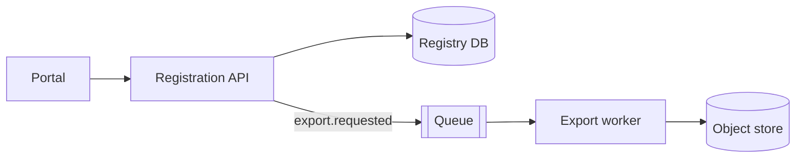
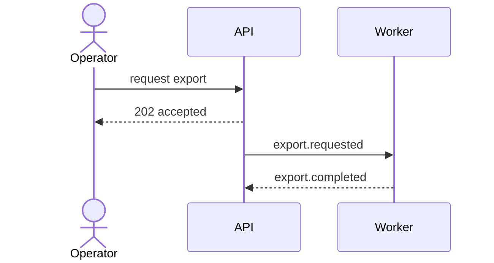
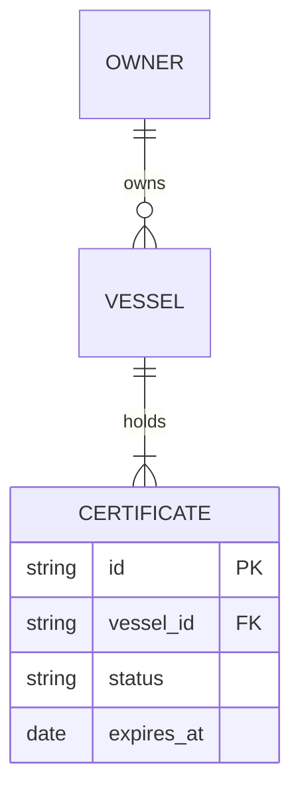
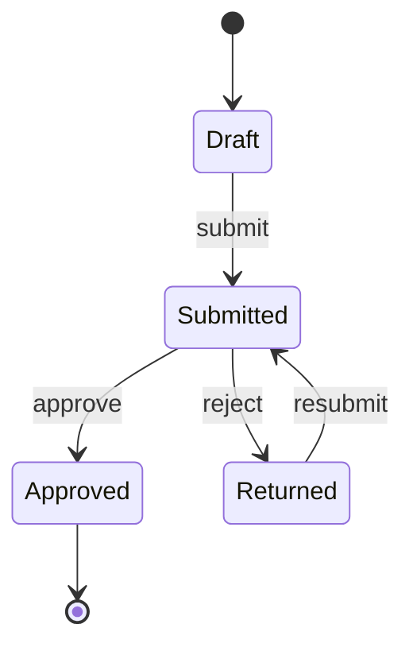
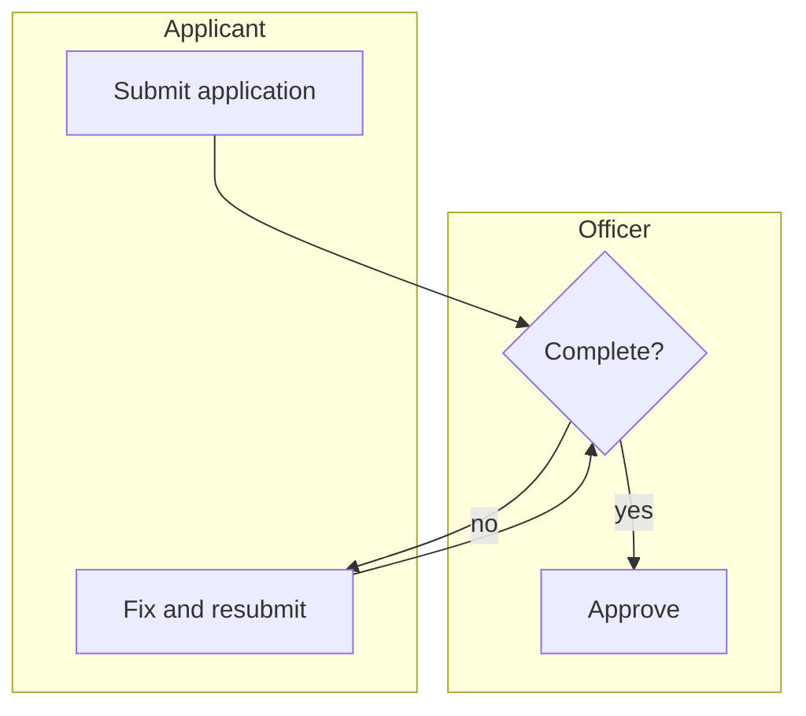

# Diagrams — which one answers which question

Mermaid, inline in the document. No external tool, no exported image, no
screenshot: a diagram that lives outside the file stops being updated with it,
and a binary cannot be reviewed in a diff.

| The question | Diagram | Mermaid type |
|---|---|---|
| What pieces exist and what talks to what? | container / component view | `flowchart` |
| What happens, in what order, between whom? | interaction | `sequenceDiagram` |
| What does the system keep track of, and how do they relate? | entity relationships | `erDiagram` |
| What states can this thing be in, and how does it move? | lifecycle | `stateDiagram-v2` |
| What does a person go through, step by step? | process | `flowchart` with lanes as subgraphs |

## Container / component view

Shapes carry meaning and keep the picture readable without a legend:
`[box]` a service or module, `[(cylinder)]` a datastore, `[[subroutine]]` a
queue or broker, `((circle))` an external actor.

## Interaction

Use it when *order* or *who waits for whom* is the point. If neither matters, a
flowchart is cheaper to read.

## Entity relationships

Cardinality is the whole reason to draw this, so get it right:
`||` exactly one · `o|` zero or one · `}o` zero or many · `}|` one or many.
Read `A ||--o{ B` as "one A, zero or many B". Carry these from discovery's
typology table rather than inventing them here.

## Lifecycle

Every state needs a way out. A state with no outgoing transition is either a
terminal state — draw it reaching `[*]` — or a bug you just found on paper,
which is the cheapest place to find one.

## Process with lanes

Subgraphs as swimlanes show *who* does each step. The rejection path is the
half that gets left out and the half stakeholders recognise.

This fence is enough while the process is being agreed. Once it must be
executed, handed to an operations team, or deployed to an engine, it needs to
be a real `.bpmn` — Mermaid has no pool, no typed gateway, and no message or
timer event. Hand off to `/modelling-business-processes` and reference the file
from here; the fence stays, as the readable summary of it.

## Rules that keep a diagram useful

1. **One question per diagram.** A picture answering three questions answers
   none. Draw three.
2. **A dozen nodes, roughly.** Past that, split by boundary — that split is
   itself a design statement.
3. **Label every edge.** An unlabelled arrow means "related somehow", which the
   reader must guess and will guess differently.
4. **Never a diagram alone.** It follows the plain-language paragraph, never
   replaces it. The reader most likely to catch the error is the one least able
   to read the notation.
5. **The table is normative; the diagram is illustrative.** Draw the picture
   only where it makes a relationship clearer than a table can — a cycle, a
   fan-out, a shape. Where both carry the same fact and they disagree, build
   from the table. Cardinality and lifecycle are the two places the picture
   earns its maintenance cost; a container view usually does too.
6. **Draw the unhappy path.** Rejected, timed out, denied, abandoned. Happy-path
   diagrams are how the error cases go unspecified.

## On C4

C4's *levels* — context, container, component — are a useful discipline: decide
which altitude you are drawing at, and do not mix two in one picture. Mermaid's
dedicated C4 diagram types have been experimental for a long time; use plain
`flowchart` with the C4 level in the caption. Stable syntax, same rigour.
